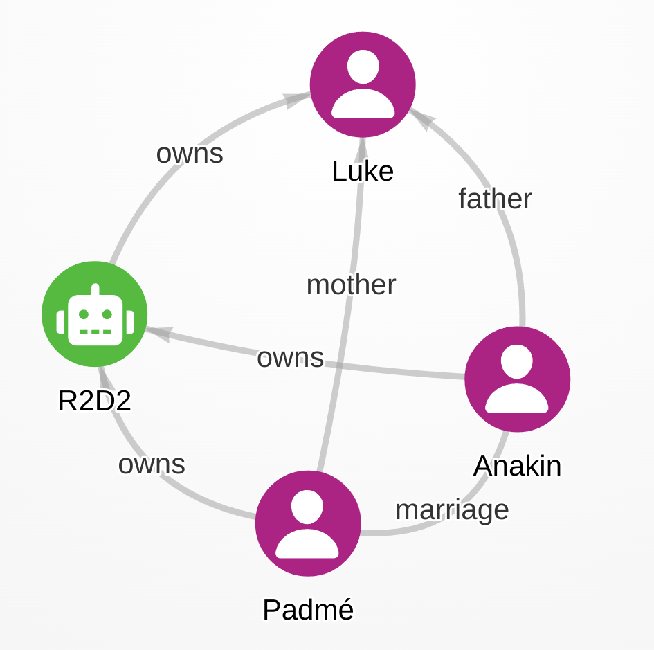

Zu den Tätigkeiten der Stabstelle Forschung und Entwicklung der VZG gehört auch
das Ausprobieren und Evaluieren neuer Verfahren und Techniken. So kommt es dass
ich mich seit Anfang 2024, angeregt durch einen Anwendungsfall im Projekt
NFDI4Objects verstärkt mit so genannten **Property-Graphen** zur Strukturierung
und Verarbeitung von (Meta)daten beschäftige. 

Kurz gesagt bilden Property-Graphen ein Datenbankmodell, das unter die so
genannten NoSQL-Datenbanken und noch spezieller unter die Graphdatenbanken
fällt. Hierbei werden Daten nicht wie bei SQL in Form von Tabellen sondern in
Form von Graphen aus Knoten gespeichert, die durch Kanten miteinander verbunden
sind. Eine Besonderheit von Property-Graphen ist, dass sowohl Knoten als auch
Kanten mit Eigenschaften versehen werden können.

## Beispiel

Zur Veranschaulichung soll folgende Sammlung einiger Charaktere, Beziehungen
und Eigenschaften aus dem Star-Wars-Universum dienen: Padmé, Anakin und Luke
sind Personen unterschiedlichen Geschlechts und R2D2 ist ein Roboter. In
Episode I gehört R2D2 zu Padmé, die ihn in Episode II Anakin zu ihrer
gemeinsamen Hochzeit schenkt, und in Episode IV gelangt der Roboter zu Luke,
der in Episode III als Kind von Padmé und Anakin geboren wurde.

Diese Informationen lassen sich in einem Property-Graphen mit Charakteren als
Knoten und ihren Beziehungen als Kanten modellieren. @lst-pg zeigt die
Kodierung des Graphen im **PG Format**, das ich derzeit zusammen mit den
Wissenschaftler Hirokazu Chiba, Ryota Yamanaka, und Shota Matsumoto als
Austauschformat für Property-Graphen entwickle. In dem Beispiel entsprechen die
Namen der Charaktere den Node-Identifiern und ihr Typ den Node-Labels . Das
Geschlecht und die jeweilige Episode sind als Properties den Knoten und Kanten
zugeordnet. Kanten haben ebenfalls ein Label mit der Beziehungsart und sie
können gerichtet (`->`) oder ungerichtet (`--`) sein.

```{#lst-pg .pg lst-cap="Beispiel-Graph im PG Format"}
# Knoten mit Knoten-Typ (Label) und Properties
Padmé  :person  gender:female
Anakin :person  gender:male                 
Luke   :person  gender:male                 
R2D2   :robot              
   
# Kanten mit Kanten-Typ (Label) und Properties
Padmé  -> R2D2   :owns      episode:1
Padmé  -- Anakin :marriage  episode:2
Anakin -> R2D2   :owns      episode:2    
Anakin -> Luke   :parent    episode:3
Padmé  -> Luke   :parent    episode:3 
R2D2   -> Luke   :owns      episode:4
```

Der Graph kann auf verschiedene Weise gespeichert und visualisiert werden.
@fig-image zeigt eine mögliche Darstellung ohne Properties.

Mit Knoten, Kanten mit Richtungen, Labels und Properties sind schon alle
Elemente von Property-Graphen aufgezählt. Je nach Datenformat und Datenbank
können Labels und Properties auch mehrere Werte annehmen, wobei verschiedene
Datentypen möglich sind.

{#fig-image}


## Datenbanken

[Neo4J]: https://neo4j.com/
[Kùzu]: https://kuzudb.com/
[Memgraph]: https://memgraph.com/
[FalkorDB]: https://www.falkordb.com/
[Vendor Lock-In]: https://it-in-bibliotheken.de/management.html#vendor-lock-in
[Cypher]: https://opencypher.org/

Etabliert wurden Property-Graphen insbesondere durch das
Datenbankmanagementsystem (DBMS) [Neo4J]. Die Open-Source-Software war lange
Marktführer in diesem Bereich und setze dort Standards wie die Abfragesprache
Cypher (Siehe @lst-cypher und @lst-match), die inzwischen auch von anderen
Anbietern unterstützt wird. Dazu zählen derzeit die Open-Source-Systeme [Kùzu],
[Memgraph] und [FalkorDB], so dass wie bei Relationalen DBMS (RDBMS) die Gefahr
für [Vendor Lock-In] gering ist. Im letzten Update des SQL-Standard (SQL:2023)
wurde zumdem unter dem Namen SQL/PGQ eine Teilmenge von Cypher als
Abfragesprache für Property-Graphen in SQL-Datenbanken definiert, es ist also
davon auszugehen, dass in Zukunft einige RDBMS Property-Graphen auch direkt
unterstützen.

Der Beispielgraph kann in Neo4J oder in einer damit kompatiblen Datenbank mit folgenden Cypher-Statements angelegt werden (@lst-cypher). Da Knoten-Identifier in der Datenbank rein intern sind, sind die Namen zusätzlich als Property `name` angegeben. Außerdem unterstützt Cypher nur gerichtete Kanten, daher ist die Beziehung zwischen Padmé und Anakin weggelassen.

```{#lst-cypher .cypher lst-cap="Beispiel-Graph als Cypher-Statements"}
CREATE (Anakin:person {gender:"male", name:"Anakin"})
CREATE (Luke:person {gender:"male", name:"Luke"})
CREATE (Padmé:person {gender:"female", name:"Padmé"})
CREATE (R2D2:robot {name:"R2D2"})
CREATE (Padmé)-[:owns {episode:"I"}]->(R2D2)
CREATE (Anakin)-[:owns {episode:"II"}]->(R2D2)
CREATE (Anakin)-[:parent {episode:"III"}]->(Luke)
CREATE (Padmé)-[:parent {episode:"III"}]->(Luke)
CREATE (R2D2)-[:owns {episode:"IV"}]->(Luke)
```

Nun können die Daten mit Cypher-Abfragen ausgewertet werden (@lst-match):

```{#lst-match .cypher lst-cap="Abfragen in Cypher-Syntax"}
# Wer sind die Eltern von Luke
...
# Wem gehört R2D2 ab Episode 2
MATCH (r)-[]->() RETURN 
```

Wie bei allen Datenbanken können die Abfrageergebnisse natürlich nur so gut
sein wie die Datenbasis: so würde eine Frage nach den Kindern von Anakin nur
Luke ergeben, weil seine Zwillingsschwester Leia im Beispiel-Graph fehlt.
Grundsätzlich stellt die Modellierung von Property-Graphen aber ein
leistungsfähiges und flexibels Werkzeug vor allem für semi-strukturierte und
verknüpfte Daten da. Im Projekt NFDI4Objects haben wir uns deshalb dazu
entschieden die Zusammenführung heterogener Daten aus verschiedenene Quellen in
einem Property-Graphen durchzuführen.


## Vergleich mit RDF

Zu den Graphdatenbanken gehören neben Property Graphen auch die RDF-Datenbanken, in denen Daten nach dem RDF-Datenmodell gespeichert werden können.

- Triples
- Können integriert werden
- Benötigen Ontologien

Vor- und Nachteile im Vergleich:

- Flexibler: keine Ontologien notwendig
- ...

Fazit: Beides hat seinen Einsatzzweck.

## Property Graphen an der VZG

- NFDI4Objects
- PG format
- pgraphs: Werkzeug zur Konvertierun

## Zusammenfassung

- Flexibler als RDF
- Standardisierung in SQL. Bisher Oracle
- Abfragesprache Cypher

